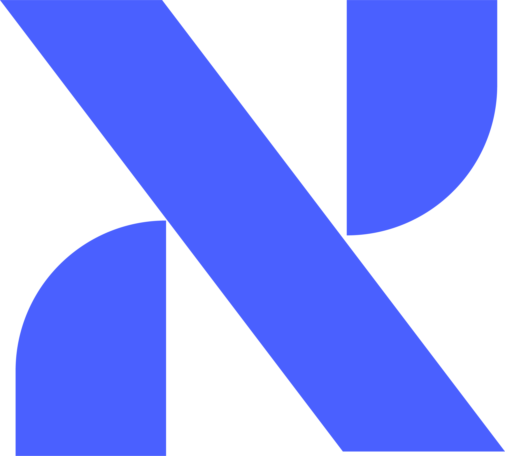

  

 

<!-- ═══════════════════════════════════════════════
     👋  GREETING — edit this section
     ═══════════════════════════════════════════════ -->

# Hi, I'm Alejandro Montoya 👋

<!-- Add your own intro here. Example:
I'm a Robotics Engineering student at Tec de Monterrey and co-founder of NX Computing — 
an edge AI startup building computer vision solutions with NVIDIA Jetson.
I like building things that sit at the intersection of hardware and intelligence.
-->

 

<!-- ═══════════════════════════════════════════════
     🔗  LINKS
     ═══════════════════════════════════════════════ -->

  
  
  <!-- Add more links below if you want, e.g. portfolio, Twitter/X -->

 

<!-- ═══════════════════════════════════════════════
     💼  ABOUT / MENTIONS — edit this section
     ═══════════════════════════════════════════════ -->

<!-- Add any mentions, affiliations, or highlights here. Examples:
- 🏫 IRS @ Tecnológico de Monterrey
- 🚀 Co-founder @ NX Computing — Edge AI · Computer Vision · NVIDIA Jetson
- 🤖 Building DeepStream pipelines for retail intelligence
- ☕ Coffee enthusiast · Muay Thai practitioner
-->

 

---

## 🛠 Languages & Tools

**Languages**

  

**AI / ML**

  
  
  

**Infrastructure & Tools**

  
  
  

 

---

## 📊 GitHub Stats

  
  

 

---

  
   
  <i>Visión que piensa</i>

